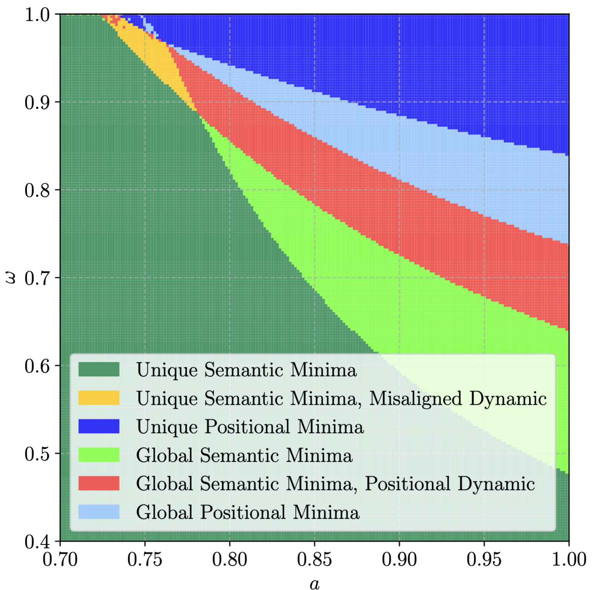

## Sequence Single Index

    

> Phase diagram of different possible configurations of a single-layer attention model learned with SGD.

### How to use
Requirements are listed in `requirements.txt`. You can install them using `pip install -r requirements.txt`.

The file structure of this repository is as follows:
 - `analytic/` contains the files for computing the populations loss.
 - `experiments/`: contains the hydra configuration files for running the experiments.
 - `simulate.py`: is the main script to run the experiments, and should be run with hydra, i.e. `python simulate.py --config-name=experiments/[config_name] --multirun`
 - `example-training.ipynb` is a Jupyter notebook that shows how to run the experiments and plot the results.
 - `example-analytic.ipynb` is a Jupyter notebook that shows how to compute the populations loss and plot the results.